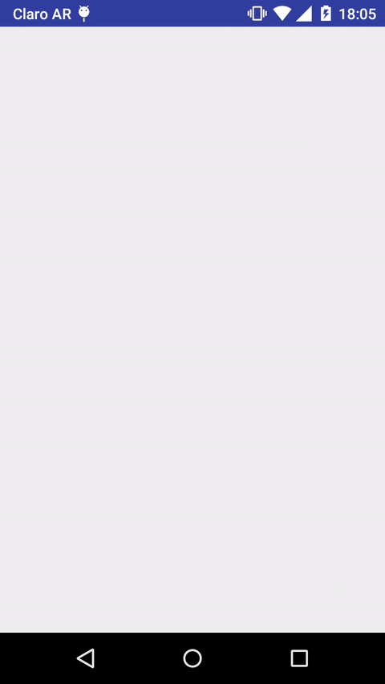

SimpleRatingBar
====

A simple RatingBar for Android.



Features
----
* Fully working `android:layout_width`: it can be set to `wrap_content`, `match_parent` or abritary dp.
* Arbitrary number of stars.
* Arbitrary step size.
* Size of stars can be controlled exactly or by setting a maximum size.
* Customizable colors (border, fill and background of stars).
* Customizable size separation between stars.
* Customizable border width of stars.
* Allows to set OnRatingBarChangeListener
* Stars fill can be set to start from left to right or from right to left (RTL language support).
* AnimationBuilder integrated in the view to set rating programatically with animation. 

Configuration
----
The view can be configured as follows:

* Set the number of stars with `app:numberOfStars` / `setNumberOfStars(int)`
* Set the rating with `app:rating` / `setRating(float)`
* Set step size with `app:stepSize` / `setStepSize(float)`
* Set star size with `app:starSize` / `setStarSize(float)`
* Set max star size with `app:maxStarSize` / `setMaxStarSize(float)`
* Set separation between stars with `app:starsSeparation` / `setStarsSeparation(float)`
* Set border width with `app:starBorderWidth` / `setStarBorderWidth(float)`
* Set stars border color with `app:borderColor` / `setBorderColor(@ColorInt int)`
* Set stars fill color with `app:fillColor` / `setFillColor(@ColorInt int)`
* Set background color with `app:backgroundColor` / `setBackgroundColor(@ColorInt int)`
* Set is indicator with `app:isIndicator` / `setIsIndicator(boolean)`
* Set gravity of fil (left or right) with `app:garvity` / `setGravity(Gravity)`

Download
----

Gradle:
```groovy
compile 'com.iarcuschin:simpleratingbar:0.0.1'
```
or Maven:
```xml
<dependency>
  <groupId>com.iarcuschin</groupId>
  <artifactId>simpleratingbar</artifactId>
  <version>0.0.1</version>
  <type>apklib</type>
</dependency>
```

License
----
    Copyright 2016 Iván Arcuschin

    Licensed under the Apache License, Version 2.0 (the "License");
    you may not use this file except in compliance with the License.
    You may obtain a copy of the License at

       http://www.apache.org/licenses/LICENSE-2.0

    Unless required by applicable law or agreed to in writing, software
    distributed under the License is distributed on an "AS IS" BASIS,
    WITHOUT WARRANTIES OR CONDITIONS OF ANY KIND, either express or implied.
    See the License for the specific language governing permissions and
    limitations under the License.

